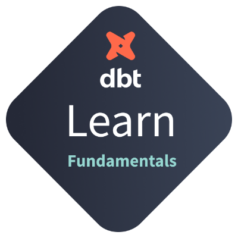

<div align="center">

# 🛠️ dbt Certified Developer — Learning Path

<p align="center">
  Repository dedicated to the <strong><a href="https://learn.getdbt.com/learn/learning-path/dbt-certified-developer">dbt Analytics Engineering Certification</a></strong> learning path offered by dbt Labs.
</p>

[](#)
[](#)
[](#)
[](#)

</div>

---

## 🎓 Certificate

<div align="center">
  <br />
  <a href="https://credentials.getdbt.com/23bd27af-631d-4592-8859-a55a248c7225#acc.LJ3k7UdE">
    
  </a>
  <p>
    🔗 <a href="https://credentials.getdbt.com/23bd27af-631d-4592-8859-a55a248c7225#acc.LJ3k7UdE"><b>Verify credential</b></a>
  </p>
</div>

---

## 🎯 Objective

The goal of this repository is to document all progress, hands-on projects, and notes throughout the 5 milestones of the certification track.

---

## 📋 Learning Path

<br>

### 🟢 Milestone 1 — dbt Fundamentals

> Core dbt concepts: models, sources, tests, documentation, and deployment.

|  #  | Course           | Status |
| :-: | ---------------- | :----: |
|  1  | dbt Fundamentals |   ✅   |

### 🟡 Milestone 2 — Jinja, Macros, and Packages

> Jinja templating, custom macros, and community packages.

|  #  | Course                      | Status |
| :-: | --------------------------- | :----: |
|  2  | Jinja, Macros, and Packages |   ✅   |

### 🔵 Milestone 3 — Advanced dbt Techniques

> Advanced techniques including incremental models, refactoring, dbt Mesh, advanced testing, and more.

|  #  | Course                         | Status |
| :-: | ------------------------------ | :----: |
|  3  | Refactoring SQL for Modularity |   ⬜   |
|  4  | Incremental Models             |   ✅   |
|  5  | Analyses and Seeds             |   ⬜   |
|  6  | Exposures                      |   ⬜   |
|  7  | Understanding State            |   ✅   |
|  8  | dbt Retry                      |   ⬜   |
|  9  | dbt Mesh Intro                 |   ✅   |
| 10  | dbt Mesh                       |   ✅   |
| 11  | Advanced Testing               |   ⬜   |
| 12  | Advanced Deployment            |   ⬜   |
| 13  | dbt Clone                      |   ✅   |
| 14  | Grants                         |   ⬜   |
| 15  | Python Models                  |   ⬜   |

### 🟣 Milestone 4 — Exam Preparation

> Preparation material and tips for the certification exam.

|  #  | Course                          | Status |
| :-: | ------------------------------- | :----: |
| 16  | Pro Tips for dbt Certifications |   ⬜   |
| 17  | dbt Developer Exam Study Guide  |   ⬜   |

### 🟠 Milestone 5 — Exam Registration

> Official exam registration and completion.

|  #  | Course                                           | Status |
| :-: | ------------------------------------------------ | :----: |
| 18  | Register dbt Analytics Engineering Certification |   ⬌   |

> ⚠️ **Note:** The certification exam will not be taken. dbt Labs only provides free vouchers to official partners, and my company does not have that status.

---

## 📂 Repository Structure

```text
📦 dbt-developer-path
 ┣ 📂 assets                  # Certificates and media
 ┣ 📂 dbt_fundamentals        # Milestone 1: Jaffle Shop
 ┣ 📂 jinja_macros_and_packages # Milestone 2: Jinja & Macros
 ┣ 📂 incremental_models      # Milestone 3: Optimization strategies
 ┗ 📜 README.md
```

---

## 🚀 Getting Started

Follow these steps to explore the hands-on projects locally:

```bash
# 1. Clone the repository
git clone https://github.com/geovannicorsino/dbt-developer-path.git
cd dbt-developer-path/dbt_fundamentals

# 2. Install dependencies
pip install -r requirements.txt

# 3. Configure dbt profile (~/.dbt/profiles.yml)
# 4. Run models
dbt run

# 5. Run tests
dbt test
```

> ⚠️ **Note:** BigQuery credentials must be configured via `gcloud auth application-default login`.

---

## 📚 Useful Resources

- 📖 [**dbt Documentation**](https://docs.getdbt.com/)
- 🎓 [**dbt Learn — Learning Path**](https://learn.getdbt.com/learn/learning-path/dbt-certified-developer)
- 💬 [**dbt Community (Slack)**](https://community.getdbt.com/)
- 📝 [**dbt Discourse**](https://discourse.getdbt.com/)
- 🧪 [**dbt Packages Hub**](https://hub.getdbt.com/)

---

<div align="center">
  <p><i>This project is for educational purposes as part of the dbt certification learning path.</i></p>
</div>
