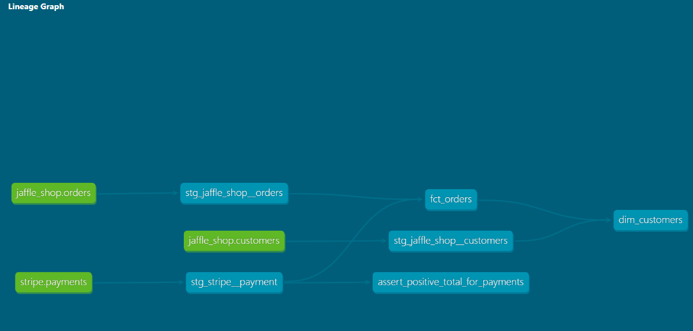

# dbt Fundamentals — Jaffle Shop

Hands-on project from the **[dbt Fundamentals](https://learn.getdbt.com/learn/course/dbt-fundamentals)** course, part of Milestone 1 of the [dbt Certified Developer](https://learn.getdbt.com/learn/learning-path/dbt-certified-developer) learning path.

---

## 🎓 Certificate

<a href="https://credentials.getdbt.com/23bd27af-631d-4592-8859-a55a248c7225#acc.LJ3k7UdE">
  
</a>

🔗 [Verify credential](https://credentials.getdbt.com/23bd27af-631d-4592-8859-a55a248c7225#acc.LJ3k7UdE)

---

## 🔗 Lineage



---

## 📂 Project Structure

```
dbt-fundamentals/
├── models/
│   ├── staging/
│   │   ├── jaffle_shop/
│   │   │   ├── _src_jaffle_shop.yml          # Source definitions (customers, orders)
│   │   │   ├── _stg_jaffle_shop.yml          # Model schema & tests
│   │   │   ├── jaffle_shop_docs.md           # Documentation blocks
│   │   │   ├── stg_jaffle_shop__customers.sql
│   │   │   └── stg_jaffle_shop__orders.sql
│   │   └── stripe/
│   │       ├── _src_stripe.yml               # Source definitions (payments)
│   │       ├── _stg_stripe.yml               # Model schema & tests
│   │       └── stg_stripe__payment.sql
│   └── marts/
│       ├── finance/
│       │   ├── _fct_orders.yml               # Model schema & tests
│       │   └── fct_orders.sql
│       └── marketing/
│           ├── _dim_customers.yml            # Model schema & tests
│           └── dim_customers.sql
├── tests/
│   └── assert_positive_total_for_payments.sql  # Singular test
├── seeds/
├── macros/
├── analyses/
├── snapshots/
├── assets/
│   └── lineage/
│       └── lineage_dbt_fundamentals.png
└── dbt_project.yml
```

---

## 🛠️ Tech Stack

| Tool         | Purpose             |
| ------------ | ------------------- |
| **dbt Core** | Data transformation |
| **BigQuery** | Data Warehouse      |

---

## 🚀 Getting Started

```bash
# Install dependencies
pip install -r requirements.txt

# Configure dbt profile (~/.dbt/profiles.yml)

# Run models
dbt run

# Run tests
dbt test

# Generate documentation
dbt docs generate
dbt docs serve
```

> ⚠️ BigQuery credentials must be configured via `gcloud auth application-default login`.

---

## 📚 Key Concepts

- Models, Sources, and Refs
- Tests (generic and singular)
- Documentation and Descriptions
- Materializations (view, table)
