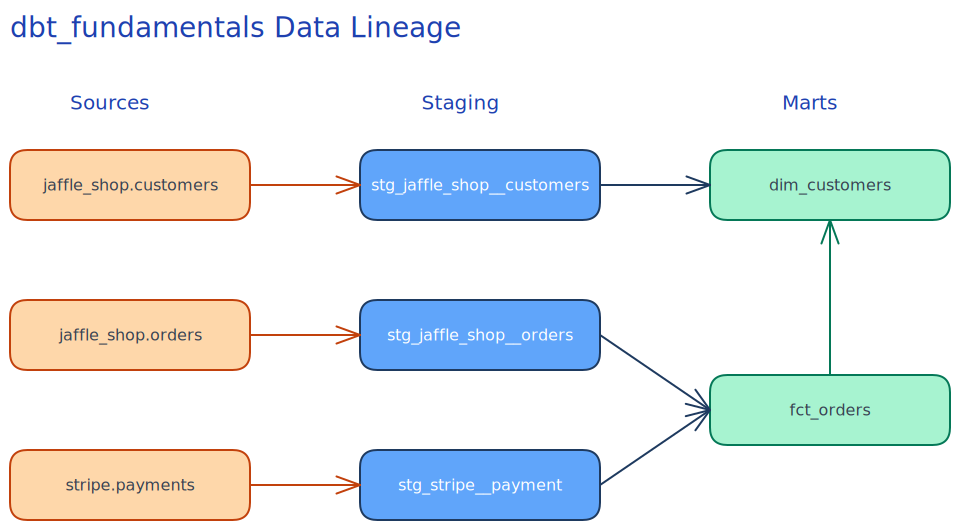

<div align="center">

# 🟢 Milestone 1: dbt Fundamentals — Jaffle Shop

<p align="center">
  Hands-on project from the <strong><a href="https://learn.getdbt.com/learn/course/dbt-fundamentals">dbt Fundamentals</a></strong> course, part of Milestone 1 of the <a href="https://learn.getdbt.com/learn/learning-path/dbt-certified-developer">dbt Certified Developer</a> learning path.
</p>

[](#)
[](#)

</div>

---

## 🔗 Lineage

<div align="center">
  <br />
  
  <p><i>Visual representation of our data models</i></p>
</div>

---

## 🎯 Key Concepts

The following fundamental concepts are covered and practically applied in this milestone:
* **Models, Sources, and Refs:** How to link dependencies predictably and modularly.
* **Tests:** Implementing generic out-of-the-box tests (`not_null`, `unique`, `accepted_values`) and custom singular tests.
* **Documentation:** Adding descriptions to columns/tables to auto-generate a data dictionary.
* **Materializations:** Deciding whether tables, views, or ephemeral models fit best (e.g. staging vs. marts).

---

## 📂 Project Structure

```text
📦 dbt_fundamentals
 ┣ 📂 models
 ┃ ┣ 📂 staging
 ┃ ┃ ┣ 📂 jaffle_shop
 ┃ ┃ ┃ ┣ 📜 _src_jaffle_shop.yml          # Source definitions
 ┃ ┃ ┃ ┣ 📜 _stg_jaffle_shop.yml          # Model schema & requirements
 ┃ ┃ ┃ ┣ 📜 jaffle_shop_docs.md           # Documentation blocks
 ┃ ┃ ┃ ┣ 📜 stg_jaffle_shop__customers.sql
 ┃ ┃ ┃ ┗ 📜 stg_jaffle_shop__orders.sql
 ┃ ┃ ┗ 📂 stripe
 ┃ ┃ ┃ ┣ 📜 _src_stripe.yml               # Source definitions
 ┃ ┃ ┃ ┣ 📜 _stg_stripe.yml               # Model schema & requirements
 ┃ ┃ ┃ ┗ 📜 stg_stripe__payment.sql
 ┃ ┗ 📂 marts
 ┃ ┃ ┣ 📂 finance
 ┃ ┃ ┃ ┣ 📜 _fct_orders.yml               # Metrics tracking config
 ┃ ┃ ┃ ┗ 📜 fct_orders.sql
 ┃ ┃ ┗ 📂 marketing
 ┃ ┃ ┃ ┣ 📜 _dim_customers.yml            # Dimension tracking config
 ┃ ┃ ┃ ┗ 📜 dim_customers.sql
 ┣ 📂 tests
 ┃ ┗ 📜 assert_positive_total_for_payments.sql  # Custom singular test
 ┣ 📂 assets
 ┃ ┗ 📂 lineage
 ┃ ┃ ┣ 📜 lineage_dbt_fundamentals.png
 ┃ ┃ ┗ 📜 lineage_excalidraw.svg
 ┣ 📜 dbt_project.yml
 ┗ 📜 README.md
```

---

## 🚀 Getting Started

Follow these steps to explore the core Jaffle Shop models locally:

```bash
# 1. Install dependencies
pip install -r requirements.txt

# 2. Configure dbt profile (~/.dbt/profiles.yml)
# Verify your BigQuery connection!

# 3. Run all models to build in BigQuery
dbt run

# 4. Run tests to ensure data quality
dbt test

# 5. Generate and serve documentation locally
dbt docs generate
dbt docs serve
```

> ⚠️ **Note:** BigQuery credentials must be configured via `gcloud auth application-default login` for standard authentication.

<br>

<div align="center">
  <p><i>Building robust data models using standard software engineering principles.</i></p>
</div>
